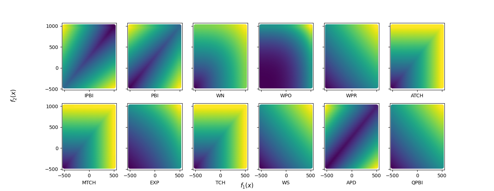

# OptiMOBO
Solve multi-objective optimisation problems using multi-objective bayesian optimisation (MOBO).

This repo is a toolbox for solving expensive to evaluate multi-objective problems. It contains implementations of MOBO methods.
The methods include:

 
* **Mono-surrogate.** This uses a single model to optimise. Objective vectors are aggregated into a single scalar value and a Gaussian process is built upon the scalarised values.
* **Multi-surrogate.** This method uses multiple models. One model for each objective. Multi-objective acquisition functions are used to identify new sample points.
* **ParEGO.** A mono-surrogate method proposed in 2006. This uses evolutionary operators to converge.
* **ParEGO-C1/C2.** Mono-surrogate methods that feature constraint handling.
* **EMO.** Multi-surrogate method exploiting probability of improvement.
* **KEEP.** Extension of ParEGO that includes a second surrogate model to improve selection of sample points.

The methods are written as classes.
They are designed to solve problems that inherit from the `Problem` class.

#### Examples 
The following code defines a bi-objective problem, MyProblem, and uses multi-surrogate Bayesian optimisation (utilising Tchebicheff aggregation as an acquisition function) to solve.
```python
import numpy as np
import optimobo.scalarisations as sc
import optimobo.optimisers as opti
from pymoo.core.problem import ElementwiseProblem

class MyProblem(ElementwiseProblem):

    def __init__(self):
        super().__init__(n_var=2,
                         n_obj=2,
                         xl=np.array([-2,-2]),
                         xu=np.array([2,2]))

    def _evaluate(self, x, out, *args, **kwargs):
        f1 = 100 * (x[0]**2 + x[1]**2)
        f2 = (x[0]-1)**2 + x[1]**2
        out["F"] = [f1, f2]

problem = MyProblem()
optimi = opti.MultiSurrogateOptimiser(problem, [0,0], [700,12])
out = optimi.solve(n_iterations=100, n_init_samples=20, sample_exponent=3, acquisition_func=sc.Tchebicheff([0,0],[700,12]))
out.plot_pareto_front()
plt.show()
```

Will return a Pareto set approximation:


For a constrained problem the constraint functions are defined in a seperate method:
```python
class BNH(Problem):
        
    def __init__(self):
        super().__init__(n_var=2, n_obj=2, n_ieq_constr=2, vtype=float)
        self.xl = np.zeros(self.n_var)
        self.xu = np.array([5.0, 3.0])

    def _evaluate(self, x, out, *args, **kwargs):
        f1 = 4 * x[:, 0] ** 2 + 4 * x[:, 1] ** 2
        f2 = (x[:, 0] - 5) ** 2 + (x[:, 1] - 5) ** 2
        out["F"] = [f1, f2]

    def _evaluate_constraints(self, x, out, *args, **kwargs):
        g1 = (1 / 25) * ((x[:, 0] - 5) ** 2 + x[:, 1] ** 2 - 25)
        g2 = -1 / 7.7 * ((x[:, 0] - 8) ** 2 + (x[:, 1] + 3) ** 2 - 7.7)
        out["G"] = [g1, g2]

problem = BNH()
optimi = ParEGO_C2(problem, [0,0],[150,55])

out1 = optimi.solve(n_iterations=10, n_init_samples=30, aggregation_func=Tchebicheff([0,0],[150,55]))

out1.plot_pareto_front()
plt.show()
```

Will return:


The output `results` is a object containing:
* ```results.pf_approx``` Solutions on the Pareto front approximation. 
* ```results.pf_inputs``` The corresponding inputs to the solutions on the Pareto front.
* ```results.pf_ysample``` All evaluated solutions.
* ```results.pf_xsample``` All inputs used in the search. 
* ```results.hypervolume_convergence``` How the hypervolume changes from iteration to iteration.

When calling the ```optimiser.solve``` function for a ```MonoSurrogateOptimiser``` object, an aggregation function must be defined.

For a ```MultiSurrogateOptimiser``` object an aggregation function can be chosen as a convergence measure. However, if left default, the optimiser will use Expected Hypervolume Improvement (EHVI) to solve the problem.

## Installation
Can be installed via:

`pip install optimobo`

## Key Features
#### Mono and multi-surrogate:
Two optimisers based on differing methods. 

#### Choice of acquisition/aggragation functions:
In mono-surrogate MOBO, scalarisation functions are used to aggregate objective vectors in a single value that can be used by the optimsier.
In multi-surrogate MOBO, scalarisation functions are used as convergence measures to select sample points.
This package contains 10 scalarisation functions that can be used in the above mentioned contexts.
Options Include:
* Weighted Sum (WS)
* Tchebicheff (TCH)
* Modified Tchebicheff (MTCH)
* Augmented Tchebicheff (ATCH)
* Weighted Norm (WN)
* Weighted Power (WPO)
* Weighted Product (WPR)
* Penality Boundary Intersection (PBI)
* Inverted PBI (IPBI)
* Quadratic PBI (QPBI)
* Exponential Weighted Criterion (EWC)
* Angle Penalised Distance (APD)

They are written so they can be used in any context.
Their contours can be seen here:


#### Utility Functions
Aside from the algorithms and scalarisations themselves this package includes implementations of useful functions for example:
* **WFG:** A function to calculate the hypervolume of a set of objective vectors.
* **Exclusive Hypervolume** Calculate the exclusive hypervolume of an objective vector.
* **Inclusive Hypervolume** Calculate the inclusive hypervolume of an objective vector.
* **Modified WFG:** A modified version of WFG that can break down a non-dominated space into cells and returns the coordinates of each cell (in the objective space).
* **generate_latin_hypercube_samples** A method of producing latin hypercube samples in any ```n``` dimensional space.
* **EHVI** 
* **Expected decomposition:** A perfomance measure that uses scalarisation functions to evaluate the performance of a decision vector.

#### Experimental Parameters
Various experimental parameters can be customised:
* Number of iterations
* Number of initial samples
* Number of samples used from the multi-variate distributions (multi-surrogate)

#### Visualisation
By calling ```result.plot_pareto_front()``` from a result object method, the program will use matplotlib to display the objective space of the problem at after the final iteration.
The hypervolume convergence can be displayed also. Calling ```result.plot_hv_convergence() will show how the hypervolume changes iteration to iteration.


## Requirements
* numpy
* scipy
* pygmo
* pymoo
* gpy
